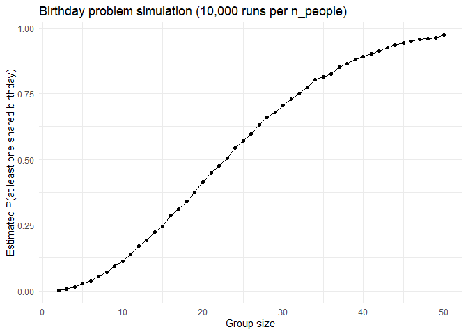
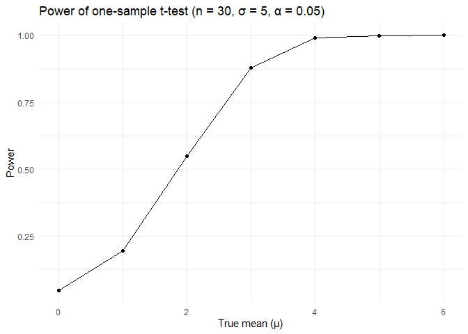
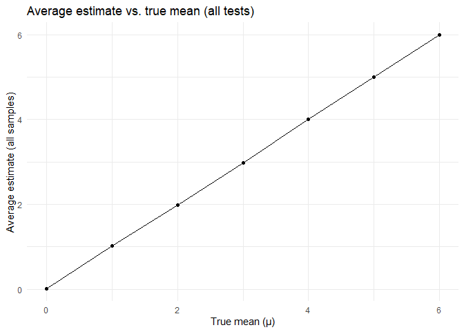
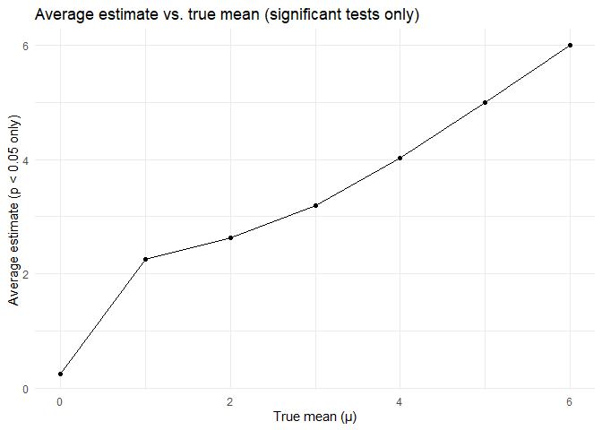
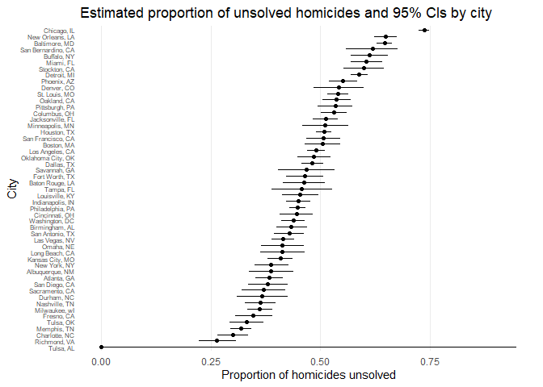

p8105_hw5_cd3591
================
Anny
2025-11-07

``` r
# set up libraries
library("tidyverse")
```

    ## ── Attaching core tidyverse packages ──────────────────────── tidyverse 2.0.0 ──
    ## ✔ dplyr     1.1.4     ✔ readr     2.1.5
    ## ✔ forcats   1.0.0     ✔ stringr   1.5.1
    ## ✔ ggplot2   3.5.2     ✔ tibble    3.3.0
    ## ✔ lubridate 1.9.4     ✔ tidyr     1.3.1
    ## ✔ purrr     1.1.0     
    ## ── Conflicts ────────────────────────────────────────── tidyverse_conflicts() ──
    ## ✖ dplyr::filter() masks stats::filter()
    ## ✖ dplyr::lag()    masks stats::lag()
    ## ℹ Use the conflicted package (<http://conflicted.r-lib.org/>) to force all conflicts to become errors

# Problem 1

``` r
# Write a function to check whether there are duplicate birthdays in the group; and return TRUE or FALSE based on the result.
birthday_shared = function(n_people){
  birthdays = sample(1:365, n_people, replace = TRUE)
  any(duplicated(birthdays))
}

# simulate 10000 times and calculate the prob
set.seed(1122)
birthday_sim_results =
  tibble(n_people = 2:50) %>% # for each group size between 2 and 50
  mutate(
    prob_shared = map_dbl(n_people,
      ~ mean(replicate(10000, birthday_shared(.x))) # run this function 10000 times & averaging across the 10000 simulation runs
    )
  )

birthday_sim_results
```

    ## # A tibble: 49 × 2
    ##    n_people prob_shared
    ##       <int>       <dbl>
    ##  1        2      0.0027
    ##  2        3      0.0072
    ##  3        4      0.0156
    ##  4        5      0.0278
    ##  5        6      0.0376
    ##  6        7      0.0539
    ##  7        8      0.0697
    ##  8        9      0.0936
    ##  9       10      0.114 
    ## 10       11      0.139 
    ## # ℹ 39 more rows

``` r
# make a plot
birthday_sim_results %>%
  ggplot(aes(x = n_people, y = prob_shared)) +
  geom_line() +
  geom_point() +
  labs(
    x = "Group size",
    y = "Estimated P(at least one shared birthday)",
    title = "Birthday problem simulation (10,000 runs per n_people)"
  ) +
  theme_minimal()
```

<!-- -->

**Comments**: The plot and table show that the probability of at least
one shared birthday is essentially zero for very small groups, but
increases rapidly as `n_people` increases. In specific, when `n_people`
= ~23, the estimated probability is about 0.50, meaning a shared
birthday is already more likely than not. By `n_people` = ~35, the
probability exceeds 0.80, and by `n_people` = ~45 it is above 0.94; at
`n_people` = ~50, the probability is roughly 0.97. This indicates that
even though there are 365 possible birthdays, only a relatively small
group is needed for a high likelihood of shared birthdays.

# Problem 2

``` r
set.seed(8105)

# function to simulate 1-sample t-tests for a given true mean mu
simulate_t_tests <- function(mu, n = 30, sigma = 5, n_sim = 5000) {
  tibble(sim = 1:n_sim) %>%
    mutate(
      x = map(sim, ~ rnorm(n, mean = mu, sd = sigma)),
      t_stats   = map(x, ~ t.test(.x, mu = 0)),
      tidy_output = map(t_stats, broom::tidy)
    ) %>%
    unnest(tidy_output) %>%
    transmute(
      mu_true = mu,
      sim,
      estimate,              
      p_value = p.value
    )
}

# Repeat the above for μ={1,2,3,4,5,6}
results_list = lapply(0:6, simulate_t_tests)   
sim_results = bind_rows(results_list)   

# the power of the test vs true mean
power_results =
  sim_results %>%
  group_by(mu_true) %>%
  summarize(
    power = mean(p_value < 0.05),
    .groups = "drop"
  )

power_results
```

    ## # A tibble: 7 × 2
    ##   mu_true  power
    ##     <int>  <dbl>
    ## 1       0 0.0486
    ## 2       1 0.195 
    ## 3       2 0.55  
    ## 4       3 0.879 
    ## 5       4 0.991 
    ## 6       5 0.999 
    ## 7       6 1

``` r
# make a plot
power_results %>%
  ggplot(aes(x = mu_true, y = power)) +
  geom_point() +
  geom_line() +
  labs(
    x = "True mean (μ)",
    y = "Power",
    title = "Power of one-sample t-test (n = 30, σ = 5, α = 0.05)"
  ) +
  theme_minimal()
```

<!-- -->

**Comments**: Power increases as the effect size (the true mean μ moving
away from 0) increases. In specific, when the true mean = 0, the
rejection rate is about 0.05 (equals the type I error). As the true mean
grows to 1, 2, and 3, power rises to roughly 0.20, 0.55, and 0.88, and
by true mean ≥ 4, the test almost always rejects the null.

``` r
# make a table for average estimate for all samples and mean estimate only in samples for which the null was rejected 
mean_results =
  sim_results %>%
  group_by(mu_true) %>%
  summarize(
    mean_estimate = mean(estimate),
    mean_estimate_reject = mean(estimate[p_value < 0.05]),
    .groups = "drop"
  )

mean_results
```

    ## # A tibble: 7 × 3
    ##   mu_true mean_estimate mean_estimate_reject
    ##     <int>         <dbl>                <dbl>
    ## 1       0        0.0157                0.258
    ## 2       1        1.02                  2.26 
    ## 3       2        1.99                  2.62 
    ## 4       3        2.98                  3.19 
    ## 5       4        4.00                  4.02 
    ## 6       5        4.99                  5.00 
    ## 7       6        5.99                  5.99

``` r
# plot 1: average estimate using ALL samples
ggplot(mean_results, aes(x = mu_true, y = mean_estimate)) +
  geom_point() +
  geom_line() +
  labs(
    x = "True mean (μ)",
    y = "Average estimate (all samples)",
    title = "Average estimate vs. true mean (all tests)"
  ) +
  theme_minimal()
```

<!-- -->

``` r
# plot 2: average estimate using ONLY significant results
ggplot(mean_results, aes(x = mu_true, y = mean_estimate_reject)) +
  geom_point() +
  geom_line() +
  labs(
    x = "True mean (μ)",
    y = "Average estimate (p < 0.05 only)",
    title = "Average estimate vs. true mean (significant tests only)"
  ) +
  theme_minimal()
```

<!-- -->
**Answer**: No. the sample average of μ_hat among tests where the null
is rejected is not approximately equal to the true μ. Based on the
graphs above, in the first plot (all tests), the points form an almost
straight line on top of the 45° line: the average estimate closely
matches the true mean μ, so μ_hat is approximately unbiased overall.
However, in the second plot (significant tests only), the points lie
clearly above the 45° line for smaller and moderate values of μ; for
example, when μ=1 or 2, the average estimate among rejected tests is
much larger than the true value. This happens because we only keep
samples with p\<0.05, i.e., those where μ_hat is far from 0 in the
direction of the true effect.

# Problem 3

``` r
homicide_raw = read_csv("homicide-data.csv")
```

    ## Rows: 52179 Columns: 12
    ## ── Column specification ────────────────────────────────────────────────────────
    ## Delimiter: ","
    ## chr (9): uid, victim_last, victim_first, victim_race, victim_age, victim_sex...
    ## dbl (3): reported_date, lat, lon
    ## 
    ## ℹ Use `spec()` to retrieve the full column specification for this data.
    ## ℹ Specify the column types or set `show_col_types = FALSE` to quiet this message.

**Description** of the raw data: The dataset contains one row per
homicide in 50 large U.S. cities from 2007–2017 so that each homicide
has its unique uid. Key variables include the victim’s name
(`victim_last` + `victim_first`), `victim_race`, `victim_sex`, and
`victim_age`; the `city` and `state` that the homicides happened; the
`reported_date` and location (`lat` + `lon`); and the case `disposition`
(e.g., “Closed by arrest”, “Closed without arrest”, “Open/No arrest”).

``` r
# tidy the raw data and create the data frame as required
homicide_city_summary =
  homicide_raw %>%
  mutate(
    city_state = str_c(city, ", ", state),
    unsolved = disposition %in% c("Closed without arrest", "Open/No arrest")
  ) %>%
  group_by(city_state) %>%
  summarize(
    total_homicides = n(),
    unsolved_homicides = sum(unsolved),
    .groups = "drop"
  )

homicide_city_summary
```

    ## # A tibble: 51 × 3
    ##    city_state      total_homicides unsolved_homicides
    ##    <chr>                     <int>              <int>
    ##  1 Albuquerque, NM             378                146
    ##  2 Atlanta, GA                 973                373
    ##  3 Baltimore, MD              2827               1825
    ##  4 Baton Rouge, LA             424                196
    ##  5 Birmingham, AL              800                347
    ##  6 Boston, MA                  614                310
    ##  7 Buffalo, NY                 521                319
    ##  8 Charlotte, NC               687                206
    ##  9 Chicago, IL                5535               4073
    ## 10 Cincinnati, OH              694                309
    ## # ℹ 41 more rows

``` r
# for the city of Baltimore, MD
baltimore_summary = homicide_city_summary %>%
  filter(city_state == "Baltimore, MD")

baltimore_summary
```

    ## # A tibble: 1 × 3
    ##   city_state    total_homicides unsolved_homicides
    ##   <chr>                   <int>              <int>
    ## 1 Baltimore, MD            2827               1825

``` r
baltimore_test = prop.test(
  x = baltimore_summary$unsolved_homicides,
  n = baltimore_summary$total_homicides
  ) %>% broom::tidy() %>%
  select(estimate, conf.low, conf.high)

baltimore_test
```

    ## # A tibble: 1 × 3
    ##   estimate conf.low conf.high
    ##      <dbl>    <dbl>     <dbl>
    ## 1    0.646    0.628     0.663

``` r
# for each of the cities
city_prop_results =
  homicide_city_summary %>%
  mutate(
    prop_test = map2(
      unsolved_homicides,
      total_homicides,
      ~ prop.test(x = .x, n = .y)
    ),
    prop_tidy = map(prop_test, broom::tidy)
  ) %>%
  unnest(prop_tidy) %>%
  select(
    city_state,
    total_homicides,
    unsolved_homicides,
    prop_unsolved = estimate,
    conf_low = conf.low,
    conf_high = conf.high
  )
```

    ## Warning: There was 1 warning in `mutate()`.
    ## ℹ In argument: `prop_test = map2(...)`.
    ## Caused by warning in `prop.test()`:
    ## ! Chi-squared approximation may be incorrect

``` r
city_prop_results
```

    ## # A tibble: 51 × 6
    ##    city_state      total_homicides unsolved_homicides prop_unsolved conf_low
    ##    <chr>                     <int>              <int>         <dbl>    <dbl>
    ##  1 Albuquerque, NM             378                146         0.386    0.337
    ##  2 Atlanta, GA                 973                373         0.383    0.353
    ##  3 Baltimore, MD              2827               1825         0.646    0.628
    ##  4 Baton Rouge, LA             424                196         0.462    0.414
    ##  5 Birmingham, AL              800                347         0.434    0.399
    ##  6 Boston, MA                  614                310         0.505    0.465
    ##  7 Buffalo, NY                 521                319         0.612    0.569
    ##  8 Charlotte, NC               687                206         0.300    0.266
    ##  9 Chicago, IL                5535               4073         0.736    0.724
    ## 10 Cincinnati, OH              694                309         0.445    0.408
    ## # ℹ 41 more rows
    ## # ℹ 1 more variable: conf_high <dbl>

**Comments**: For each city we used `prop.test` to estimate the
proportion of unsolved homicides and its 95% CI. One city produced a
warning that the chi-squared approximation may be inaccurate due to
small counts.

``` r
# make the plot
city_prop_results %>%
  mutate(
    city_state = fct_reorder(city_state, prop_unsolved)
    ) %>%
  ggplot(aes(x = city_state, y = prop_unsolved)) +
  geom_point() +
  geom_errorbar(aes(ymin = conf_low, ymax = conf_high),
                width = 0) +
  coord_flip() +
  labs(
    x = "City",
    y = "Proportion of homicides unsolved",
    title = "Estimated proportion of unsolved homicides and 95% CIs by city"
  ) +
  theme_minimal() +
  theme(
    axis.text.y = element_text(size = 6),         
    panel.grid.major.y = element_blank(),         
    panel.grid.minor = element_blank()
  )
```

<!-- -->
